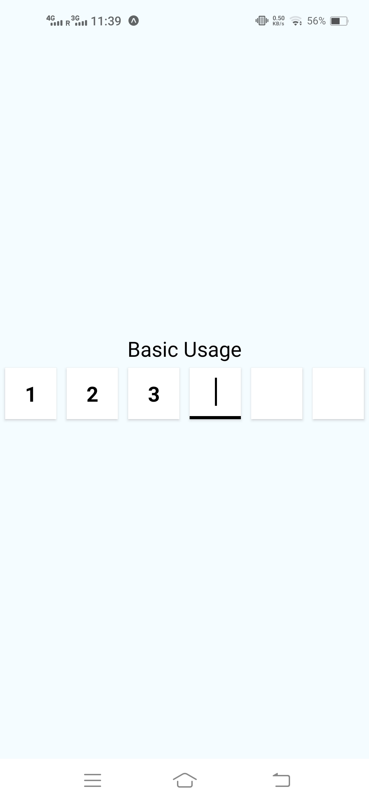
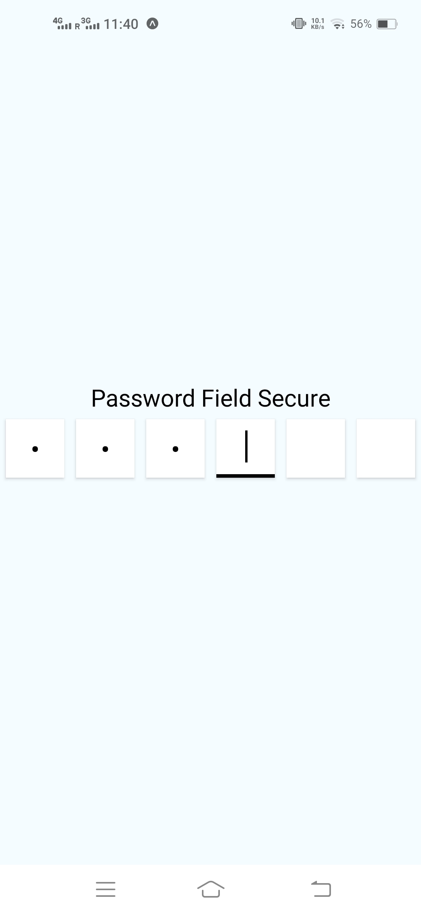
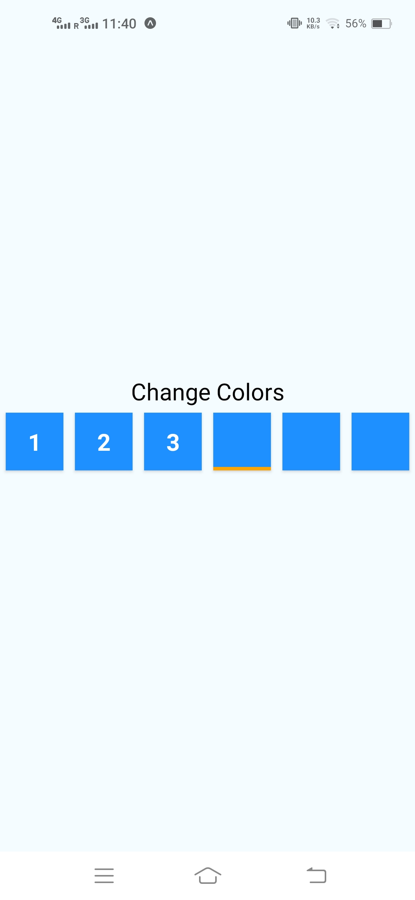
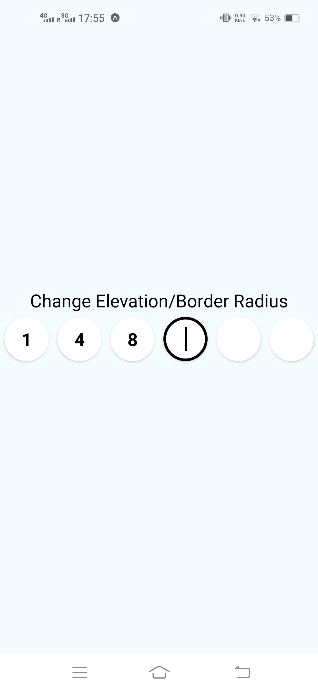

# react-native-otp-input-fields

This is a component for OTP Input fields.

- [Installation](https://github.com/kartikeyvaish/react-native-otp-input-fields#installation)
- [Usage](https://github.com/kartikeyvaish/react-native-otp-input-fields#usage)
- [Docs](https://github.com/kartikeyvaish/react-native-otp-input-fields#parameters)

## Installation

```javascript
npm i react-native-otp-input-fields
```

NOTE: This package uses `react-native-reanimated` under the hood for animation. Please Follow the installation process of [React Native Reanimated](https://docs.swmansion.com/react-native-reanimated/docs/fundamentals/installation)
## Usage

Below are some examples to use this package

### Basic Usage

```javascript
import OTPInput from "react-native-otp-input-fields";

const [OTP, SetOTP] = useState("");
// Maintain a state variable

// Use it like this
<OTPInput onChangeText={SetOTP} value={OTP} />;
```



---

### Password Secure Usage

```javascript
import OTPInput from "react-native-otp-input-fields";

const [OTP, SetOTP] = useState("");
// Maintain a state variable

// Use it like this
<OTPInput onChangeText={SetOTP} value={OTP} secureTextEntry={true} />;
```



---

### Change Colors and other styles

```javascript
import OTPInput from "react-native-otp-input-fields";

const [OTP, SetOTP] = useState("");
// Maintain a state variable

// Use it like this
<OTPInput
  onChangeText={SetOTP}
  value={OTP}
  borderColor="orange"
  boxBackgroundColor="dodgerblue"
  cursorColor="orange"
  digitColor="white"
/>;
```



---

### Apply Elevation and Border Radius etc.

```javascript
import OTPInput from "react-native-otp-input-fields";

const [OTP, SetOTP] = useState("");
// Maintain a state variable

// Use it like this
<OTPInput
  onChangeText={SetOTP}
  value={OTP}
  boxBorderRadius={50}
  onlyBorderBottom={false}
  boxElevation={10}
/>;
```



---

## Parameters

### Basic Parameters

| Parameter         | required | Default     | Description                                                                              |
| ----------------- | -------- | ----------- | ---------------------------------------------------------------------------------------- |
| value             | YES      |             | Maintain a state in parent component and use it as a controlled input                    |
| onChangeText      | YES      |             | the onChangeText function to update the state in parent component                        |
| count             | NO       | 6           | Number of digits in the OTP                                                              |
| autoFocus         | NO       | false       | Whether to autofocus the first field                                                     |
| removeOnBackspace | NO       | true        | Whether to clear the previous input while pressing the backspace button on a input field |
| onSubmitEditing   | NO       |             | function to execute when user presses the done button on keyboard                        |
| containerWidth    | NO       | screenWidth | Width of the Input Field Container                                                       |
| boxHeight         | NO       | 60          | Height of each input field                                                               |
| margin            | NO       | 5           | margin between each input field                                                          |

### Customization

| Parameter          | required | Default | Description                                                        |
| ------------------ | -------- | ------- | ------------------------------------------------------------------ |
| secureTextEntry    | NO       | false   | Mask the text input as password field or not                       |
| allowDigitsOnly    | NO       | false   | Allow only digits to be entered in the text input                  |
| digitFontSize      | NO       | 25      | font size of the text inside input field                           |
| animateDuration    | NO       | 300ms   | Duration for the animation to complete when input field is focused |
| cursorColor        | NO       | black   | color of the blinking cursor                                       |
| digitColor         | NO       | black   | color of the digit inside the field                                |
| onlyBorderBottom   | NO       | true    | whether to show border around whole box or just the border bottom  |
| keyboardType       | NO       | true    | type of Keyboard from `KeyboardTypeOptions` in react-native        |
| borderBottomWidth  | NO       | 3       | width for the border bottom of box                                 |
| borderColor        | NO       | `black` | color for the border of box                                        |
| boxElevation       | NO       | `6`     | elevation for the input field box                                  |
| maxLength          | NO       | 1       | Max length of each input field                                     |
| inputStyle         | NO       |         | styles for the `TextInput` component                               |
| boxHeight          | NO       | 60      | height of each input field                                         |
| boxBorderRadius    | NO       | 0       | border Radius of input field                                       |
| boxContainerStyle  | NO       |         | styles for the input containers                                    |
| containerStyle     | NO       |         | styles for the whole input box container (outer)                   |
| boxBackgroundColor | NO       | `white` | backround Color of the input fields                                |
